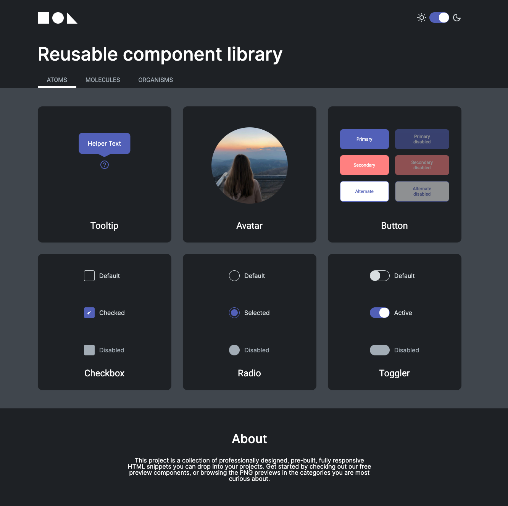

# Component Library
The goal of this library is to learn how to create most used UI components with HTML and CSS.
The base of this project - the course on the platform Learn Javascript (https://learn.javascript.ru/courses/htmlcss). In addition it has been written with React.
## Features
- Reusable components
- Mobile first
- Animations
- Syntax highlighter due to the selected theme

## How to start
Github page - https://nvknkhv.github.io/component-library

Or
```sh
clone repository
npm i
npm start
open localhost:9000
```
## What used
- React, React router v6
- PropTypes, because I think that TS for this project is overhead
- Webpack
- SCSS and styled components

Preview:

